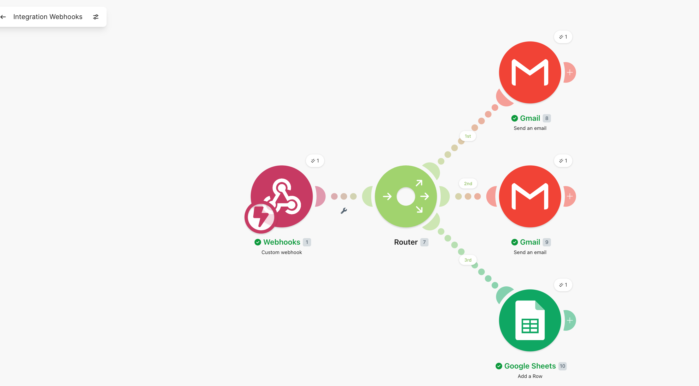
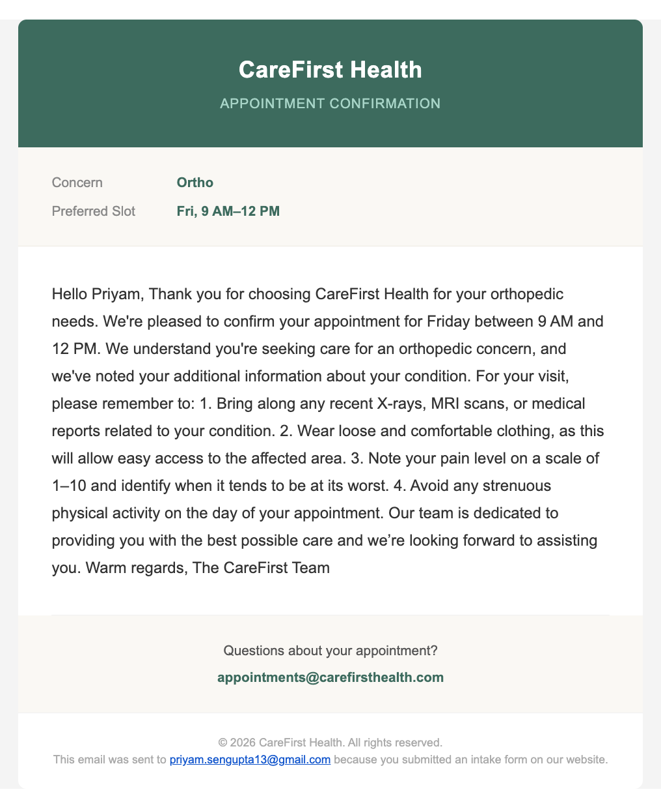
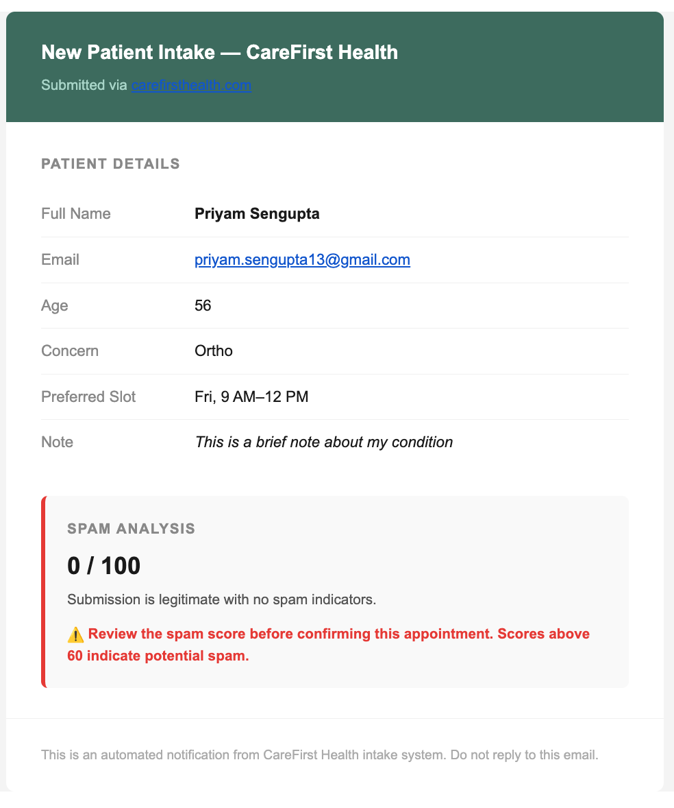
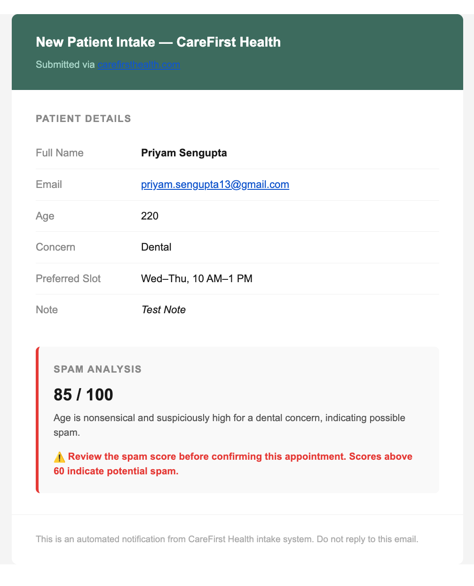
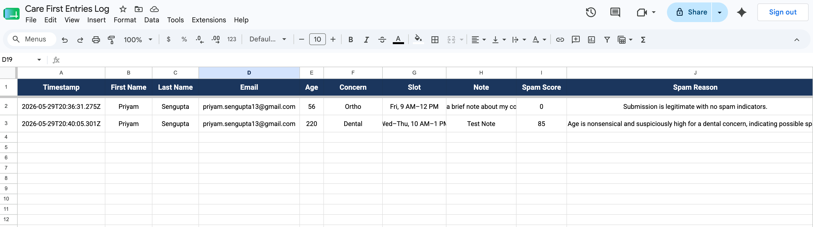

# CareFirst Health — Patient Intake & AI Appointment Confirmation

> **Tagline:** Your care, confirmed in seconds.

A fictional multi-specialty clinic demo that lets a patient fill in a short intake form and receive a **personalized, AI-generated confirmation email** within 60 seconds — fully automated, zero manual intervention.

---

## Overview

| | |
|---|---|
| **Version** | 2.0 |
| **Status** | Live |
| **Date** | 30 May 2026 |

### What it does

1. Patient fills a short form (name, email, age, concern, slot, optional note)
2. Form POSTs to the Node.js server
3. Server runs two **OpenAI GPT-4o** calls in parallel:
   - Generates a personalized, concern-specific email body
   - Scores the submission for spam (0–100)
4. Server forwards the full payload (including spam score) to **Make.com**
5. Make.com fans out to three branches simultaneously:
   - Sends a confirmation email to the **patient** via Gmail
   - Sends an admin notification email with the spam score to the **admin**
   - Appends a row to a **Google Sheet** for tracking

### Specialties supported

| Concern | Pre-visit instructions |
|---|---|
| 🩺 General Checkup | Fast 8 hrs, bring ID/insurance, list meds, comfortable clothing, arrive early |
| 🦷 Dental | Brush & floss, note pain/sensitivity, avoid eating 2 hrs before, list meds |
| 🦴 Ortho | Bring X-rays/scans, loose clothing, pain scale 1–10, no strenuous activity |
| 🧠 Mental Health | Arrive calm, bring notes on feelings, complete intake form, HIPAA confidentiality |

---

## Tech Stack

| Layer | Technology |
|---|---|
| Frontend | HTML + CSS + Vanilla JS (single file) |
| Backend | Node.js + Express |
| AI | OpenAI GPT-4o (email generation + spam scoring) |
| Automation | Make.com (3-branch scenario) |
| Patient email | Gmail via Make.com |
| Admin email | Gmail via Make.com |
| Data logging | Google Sheets via Make.com |

---

## Project Structure

```
care-first/
├── README.md
├── docs/
│   └── screenshots/             # Real-world example screenshots
└── server/
    ├── public/
    │   └── index.html           # Patient intake form — served at localhost:3000
    ├── index.js                 # Express server — /intake route, parallel OpenAI calls, Make.com handoff
    ├── prompts.js               # System prompt, email prompt, spam scoring prompt
    ├── package.json
    ├── .env                     # Your secrets (gitignored)
    └── .env.example             # Template — copy this to .env
```

---

## Setup & Installation

### Prerequisites

- Node.js v18+
- An OpenAI account with a valid API key
- A Make.com account (free tier works)
- A Google account (for Gmail + Google Sheets)

### 1. Install dependencies

```bash
cd server
npm install
```

### 2. Configure environment variables

```bash
cp .env.example .env
```

Open `server/.env` and fill in:

```env
OPENAI_API_KEY=sk-proj-xxxxxxxxxxxxxxxx
MAKE_WEBHOOK_URL=https://hook.us2.make.com/your_webhook_id_here
MAKE_WEBHOOK_API_KEY=your_make_webhook_api_key_here
PORT=3000
```

| Variable | Where to get it |
|---|---|
| `OPENAI_API_KEY` | [platform.openai.com/api-keys](https://platform.openai.com/api-keys) |
| `MAKE_WEBHOOK_URL` | Generated when you create the webhook in Make.com (Step 2 below) |
| `MAKE_WEBHOOK_API_KEY` | Make.com → Webhooks → your webhook → **Show advanced settings** |

---

## Make.com Scenario Setup

The Make.com scenario receives every intake submission and fans it out to three outputs in parallel: patient email, admin email, and Google Sheets.

### Architecture

```
Custom Webhook
      │
   Router
   ├── 1st → Gmail → Patient confirmation email
   ├── 2nd → Gmail → Admin notification + spam score
   └── 3rd → Google Sheets → Append row with all fields
```



---

### Part 1 — Prepare your Google Sheet

Before building the scenario, create a new Google Sheet named **Care First Entries Log**. Add these exact headers in Row 1:

| A | B | C | D | E | F | G | H | I | J |
|---|---|---|---|---|---|---|---|---|---|
| Timestamp | First Name | Last Name | Email | Age | Concern | Slot | Note | Spam Score | Spam Reason |

---

### Part 2 — Build the Scenario

#### Step 1 — Create a new scenario

1. Log in to [make.com](https://make.com)
2. Click **Scenarios** → **+ Create a new scenario**
3. Click the large **+** on the blank canvas

#### Step 2 — Add the Webhook trigger

1. Search **Webhooks** → select **Custom Webhook**
2. Click **Add** → name it `CareFirst Intake` → click **Save**
3. Make.com generates a URL like `https://hook.us2.make.com/xxxxxxxx`
4. **Copy this URL** and paste it into `server/.env` as `MAKE_WEBHOOK_URL`

#### Step 3 — Teach Make.com the data shape

1. Click **Re-determine data structure** on the webhook module
2. Start your server locally (`npm run dev` inside `server/`)
3. Fire a test submission:

```bash
curl -X POST http://localhost:3000/intake \
  -H "Content-Type: application/json" \
  -d '{
    "first_name": "Test",
    "last_name": "User",
    "email": "test@example.com",
    "age": "30",
    "concern": "Dental",
    "slot": "Fri, 9 AM–12 PM",
    "note": "Test submission"
  }'
```

4. Make.com detects all fields including `spam_score` and `spam_reason` → click **Save**

#### Step 4 — Add a Router

1. Click **+** after the Webhook module
2. Search **Flow control** → select **Router**
3. The Router creates parallel branches — you need 3

#### Step 5 — Branch 1: Patient Confirmation Email (Gmail)

1. Click **+** on the **1st** branch
2. Search **Gmail** → **Send an Email**
3. Connect your Google account when prompted
4. Map the fields:

| Field | Value |
|---|---|
| To | `{{email}}` |
| Subject | `{{email_subject}}` |
| Content type | HTML |
| Body | *(paste the patient email HTML template — see below)* |
| From name | `CareFirst Health` |
| Reply-To | `appointments@carefirsthealth.com` |

**Patient email HTML body:**

```html
<!DOCTYPE html>
<html>
<body style="margin:0;padding:0;background:#f4f4f4;font-family:Arial,sans-serif;">
  <div style="max-width:600px;margin:32px auto;background:#ffffff;border-radius:8px;overflow:hidden;box-shadow:0 2px 8px rgba(0,0,0,0.08);">
    <div style="background:#3d6b5e;padding:32px;text-align:center;">
      <h1 style="margin:0 0 6px;color:#ffffff;font-size:22px;font-weight:700;letter-spacing:0.02em;">CareFirst Health</h1>
      <p style="margin:0;color:#a8d5c8;font-size:13px;letter-spacing:0.05em;text-transform:uppercase;">Appointment Confirmation</p>
    </div>
    <div style="background:#faf8f4;padding:20px 32px;border-bottom:1px solid #ede9e1;">
      <table style="width:100%;border-collapse:collapse;font-size:13px;">
        <tr>
          <td style="padding:4px 0;color:#888;width:120px;">Concern</td>
          <td style="padding:4px 0;color:#3d6b5e;font-weight:600;">{{concern}}</td>
        </tr>
        <tr>
          <td style="padding:4px 0;color:#888;">Preferred Slot</td>
          <td style="padding:4px 0;color:#3d6b5e;font-weight:600;">{{slot}}</td>
        </tr>
      </table>
    </div>
    <div style="padding:32px;font-size:15px;line-height:1.75;color:#333333;">
      {{email_body}}
    </div>
    <div style="margin:0 32px;border-top:1px solid #f0f0f0;"></div>
    <div style="padding:24px 32px;background:#faf8f4;text-align:center;">
      <p style="margin:0 0 6px;font-size:13px;color:#555;">Questions about your appointment?</p>
      <a href="mailto:appointments@carefirsthealth.com" style="font-size:13px;color:#3d6b5e;font-weight:600;text-decoration:none;">appointments@carefirsthealth.com</a>
    </div>
    <div style="padding:20px 32px;text-align:center;border-top:1px solid #f0f0f0;">
      <p style="margin:0;font-size:11px;color:#aaa;">© 2026 CareFirst Health. All rights reserved.<br>This email was sent to {{email}} because you submitted an intake form on our website.</p>
    </div>
  </div>
</body>
</html>
```

#### Step 6 — Branch 2: Admin Notification Email (Gmail)

1. Click **+** on the **2nd** branch
2. Search **Gmail** → **Send an Email**
3. Map the fields:

| Field | Value |
|---|---|
| To | your admin email address |
| Subject | `New Intake: {{first_name}} {{last_name}} — {{concern}} (Spam: {{spam_score}})` |
| Content type | HTML |
| Body | *(paste the admin email HTML template — see below)* |

**Admin email HTML body:**

```html
<!DOCTYPE html>
<html>
<body style="margin:0;padding:0;background:#f4f4f4;font-family:Arial,sans-serif;">
  <div style="max-width:600px;margin:32px auto;background:#ffffff;border-radius:8px;overflow:hidden;box-shadow:0 2px 8px rgba(0,0,0,0.08);">
    <div style="background:#3d6b5e;padding:24px 32px;">
      <h2 style="margin:0;color:#ffffff;font-size:18px;font-weight:600;">New Patient Intake — CareFirst Health</h2>
      <p style="margin:6px 0 0;color:#a8d5c8;font-size:13px;">Submitted via carefirsthealth.com</p>
    </div>
    <div style="padding:28px 32px 0;">
      <h3 style="margin:0 0 16px;font-size:13px;text-transform:uppercase;letter-spacing:0.08em;color:#888;">Patient Details</h3>
      <table style="width:100%;border-collapse:collapse;font-size:14px;">
        <tr style="border-bottom:1px solid #f0f0f0;">
          <td style="padding:10px 0;color:#888;width:140px;">Full Name</td>
          <td style="padding:10px 0;color:#1a1a1a;font-weight:600;">{{first_name}} {{last_name}}</td>
        </tr>
        <tr style="border-bottom:1px solid #f0f0f0;">
          <td style="padding:10px 0;color:#888;">Email</td>
          <td style="padding:10px 0;color:#1a1a1a;">{{email}}</td>
        </tr>
        <tr style="border-bottom:1px solid #f0f0f0;">
          <td style="padding:10px 0;color:#888;">Age</td>
          <td style="padding:10px 0;color:#1a1a1a;">{{age}}</td>
        </tr>
        <tr style="border-bottom:1px solid #f0f0f0;">
          <td style="padding:10px 0;color:#888;">Concern</td>
          <td style="padding:10px 0;color:#1a1a1a;">{{concern}}</td>
        </tr>
        <tr style="border-bottom:1px solid #f0f0f0;">
          <td style="padding:10px 0;color:#888;">Preferred Slot</td>
          <td style="padding:10px 0;color:#1a1a1a;">{{slot}}</td>
        </tr>
        <tr>
          <td style="padding:10px 0;color:#888;vertical-align:top;">Note</td>
          <td style="padding:10px 0;color:#1a1a1a;font-style:italic;">{{note}}</td>
        </tr>
      </table>
    </div>
    <div style="margin:28px 32px 0;padding:20px;background:#f9f9f9;border-radius:6px;border-left:4px solid #e53935;">
      <h3 style="margin:0 0 8px;font-size:13px;text-transform:uppercase;letter-spacing:0.08em;color:#888;">Spam Analysis</h3>
      <p style="margin:0 0 4px;font-size:22px;font-weight:700;color:#1a1a1a;">{{spam_score}} / 100</p>
      <p style="margin:0;font-size:13px;color:#555;">{{spam_reason}}</p>
      <p style="margin:12px 0 0;font-size:13px;font-weight:600;color:#e53935;">⚠️ Review the spam score before confirming this appointment. Scores above 60 indicate potential spam.</p>
    </div>
    <div style="padding:24px 32px;margin-top:28px;border-top:1px solid #f0f0f0;">
      <p style="margin:0;font-size:12px;color:#aaa;">This is an automated notification from CareFirst Health intake system. Do not reply to this email.</p>
    </div>
  </div>
</body>
</html>
```

#### Step 7 — Branch 3: Google Sheets (Add a Row)

1. Click **+** on the **3rd** branch
2. Search **Google Sheets** → **Add a Row**
3. Connect your Google account → select **Care First Entries Log**
4. Map each column:

| Sheet Column | Make.com value |
|---|---|
| Timestamp | `{{now}}` |
| First Name | `{{first_name}}` |
| Last Name | `{{last_name}}` |
| Email | `{{email}}` |
| Age | `{{age}}` |
| Concern | `{{concern}}` |
| Slot | `{{slot}}` |
| Note | `{{note}}` |
| Spam Score | `{{spam_score}}` |
| Spam Reason | `{{spam_reason}}` |

#### Step 8 — Save and activate

1. Click **Save** (bottom left)
2. Toggle the scenario **ON**
3. Set scheduling to **Instantly**

---

## Real-World Examples

### Patient Confirmation Email

The patient receives a branded confirmation with their concern, preferred slot, and a personalized AI-generated message including pre-visit instructions.



---

### Admin Notification — Legitimate Submission (Spam Score: 0)

When a genuine submission comes in, the admin receives a clean summary. The spam score of 0 signals no action needed.



---

### Admin Notification — Suspicious Submission (Spam Score: 85)

When the AI detects signals like an impossible age (220) or mismatched data, it flags the submission with a high spam score and a clear reason.



---

### Google Sheets Log

Every submission — legitimate or flagged — is appended to the sheet. The admin can sort by Spam Score to quickly identify and review suspicious entries.



---

## Test Walkthrough

### Step 1 — Start the server

```bash
cd server
npm run dev
```

Expected output:
```
CareFirst server running on http://localhost:3000
```

### Step 2 — Open the form

Visit [http://localhost:3000](http://localhost:3000). The landing page is served directly by Express.

### Step 3 — Submit the form

Fill in all fields using your real email address, then click **Confirm my appointment**.

- Loading spinner appears → then the green success state
- Check the server terminal — no `Intake error:` lines means all good

### Step 4 — Check three places

Within **60 seconds**:

| Where | What you should see |
|---|---|
| Patient inbox | Branded confirmation email with concern-specific instructions |
| Admin inbox | Notification with full submission summary and spam score |
| Google Sheet | New row appended with all fields including spam score |

### Quick smoke test via curl

```bash
# Legitimate submission
curl -X POST http://localhost:3000/intake \
  -H "Content-Type: application/json" \
  -d '{
    "first_name": "Priyam",
    "last_name": "Sengupta",
    "email": "your@email.com",
    "age": "30",
    "concern": "Ortho",
    "slot": "Fri, 9 AM–12 PM",
    "note": "Pain in left knee for 3 weeks"
  }'

# Suspicious submission (age 220 — expect high spam score)
curl -X POST http://localhost:3000/intake \
  -H "Content-Type: application/json" \
  -d '{
    "first_name": "Test",
    "last_name": "User",
    "email": "test@example.com",
    "age": "220",
    "concern": "Dental",
    "slot": "Wed–Thu, 10 AM–1 PM",
    "note": "Test Note"
  }'
```

Expected response for both: `{"success":true}`

The difference shows up in the admin email and Google Sheet — the second submission will carry a spam score of ~85 with a reason like *"Age is nonsensical and suspiciously high for a dental concern."*

---

## Troubleshooting

| Symptom | Likely cause | Fix |
|---|---|---|
| Spinner never stops | Server not running | Run `npm run dev` in `server/` |
| `{"error":"Something went wrong"}` | OpenAI or Make.com call failed | Check terminal for `Intake error:` log |
| Email doesn't arrive | Make.com scenario is OFF | Toggle it ON, set to Instantly |
| `spam_score` missing in sheet | Old webhook data shape | Click webhook → Re-determine data structure → fire test curl |
| `401` from OpenAI | Invalid API key | Check `OPENAI_API_KEY` in `.env` |
| Make.com webhook returns 401 | Missing or wrong API key | Check `MAKE_WEBHOOK_API_KEY` in `.env` |
| Spam parse failed (logged) | GPT returned markdown fences | Already handled — defaults to score 0 |

---

## Acceptance Criteria

- [x] Form submits with success confirmation message
- [x] Server responds within 5 seconds
- [x] AI generates a non-generic, concern-specific email
- [x] Spam score generated in parallel — does not add latency
- [x] Patient email delivered within 60 seconds
- [x] Admin email received with spam score and reason
- [x] Google Sheet row appended on every submission
- [x] High spam score (>60) clearly visible in admin email and sheet
- [x] All 4 concern types produce different email content

---

## Out of Scope (v2.0)

- Real patient data / HIPAA compliance
- Calendar integration or slot availability checks
- SMS / WhatsApp notifications
- Authentication or login
- Auto-rejecting submissions above a spam threshold
